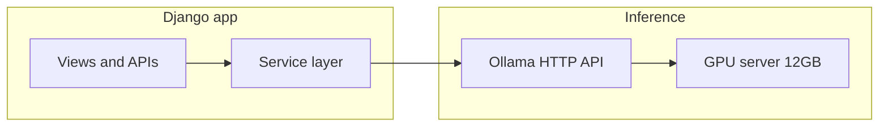

# AI Study Guide — Django + Ollama Stack

A delimited study path for **learning AI through Django**: you build expertise in **Django applications that call inference backends** (this guide assumes **Ollama** on a dedicated server with a **12GB GPU**). Broader AI theory, raw PyTorch workflows, and robotics live in [appendices](#appendices) so this document stays readable end-to-end.

**Language:** English (cheatsheet style: TOC, anchors, copy-pasteable snippets).  
**Folder index:** [INDEX.md](INDEX.md) lists all files in `Cheatsheets/AI/`.

**Examples assume:** Python **3.10+** and a recent **Django 4.x/5.x** (syntax like `list[dict]` and `str | None`).

---

## Table of Contents

- [How to use this document](#how-to-use-this-document)
- [Scope](#scope)
- [Architecture at a glance](#architecture-at-a-glance)
- [Getting value from your hardware](#getting-value-from-your-hardware)
- [Principles for beginners](#principles-for-beginners)
- [1. Who this is for](#1-who-this-is-for--how-your-situation-shapes-the-guide)
- [2. Minimum viable AI for Django developers](#2-minimum-viable-ai-for-django-developers)
  - [2.2 Why HTTP, not PyTorch in every view](#guide-sec-22-why-http)
- [3. Ollama as the backend (developer contract)](#3-ollama-as-the-backend-developer-contract)
  - [3.2 Verify with curl](#guide-sec-32-curl)
- [4. Django project shape for AI features](#4-django-project-shape-for-ai-features)
  - [4.0 Local environment and new project](#guide-sec-40-local-setup)
  - [4.1 Settings](#guide-sec-41-settings) · [4.4 Bigger picture](#guide-sec-44-bigger-picture)
- [5. Progressive Django integration (the spine)](#5-progressive-django-integration-the-spine)
  - [5.1 What step A means](#guide-spine-step-a)
  - [5.2 What steps B and C mean](#guide-spine-step-bc)
  - [5.3 What steps D and E mean](#guide-spine-step-de)
- [Step checklist (A to E)](#step-checklist-a-to-e)
- [6. Product and safety basics](#6-product-and-safety-basics)
- [7. When to reach beyond Django](#7-when-to-reach-beyond-django)
- [FAQ and troubleshooting](#faq-and-troubleshooting)
- [Example `.env` variables](#example-env-variables)
- [Appendices](#appendices)

---

## How to use this document

1. Skim **[INDEX.md](INDEX.md)** if you want a map of every file in this folder. For hands-on practice, see **[exercises/README.md](exercises/README.md)** — three guided tracks (**01** = A, **02** = B–C, **03** = D–E).
2. Read **Sections 1–4** once to align mental model and project layout.
3. Follow **Section 5** in order and use the **[step checklist](#step-checklist-a-to-e)** to mark progress.
4. When something breaks, see **[FAQ and troubleshooting](#faq-and-troubleshooting)** first, then **[appendix-tooling-stack.md](appendix-tooling-stack.md)**.
5. For recipes (timeouts, Celery, SSE, security, health checks, tests), open **[appendix-django-integration.md](appendix-django-integration.md)**.
6. For **apps, settings, deployment, testing, and flags** in a full product, read **[appendix-django-ai-project.md](appendix-django-ai-project.md)**.
7. Use **[appendix-hardware-gpu.md](appendix-hardware-gpu.md)** when choosing Ollama models for 12GB VRAM.
8. Use **[appendix-remote-server.md](appendix-remote-server.md)** when Django runs on one machine and Ollama on another.
9. **[appendix-glossary.md](appendix-glossary.md)** defines terms from a web-developer angle.
10. When steps A–E feel comfortable, read **[appendix-topics-beyond-the-spine.md](appendix-topics-beyond-the-spine.md)** to pick the next skill (embeddings, RAG depth, evals) and **[appendix-learning-resources.md](appendix-learning-resources.md)** for official docs and bookmarks.

---

## Scope

| In scope | Out of scope (see appendices or external courses) |
|----------|-----------------------------------------------------|
| Django views, settings, HTTP clients to Ollama, queues, streaming, persistence, tests, deployment mindset | Training foundation models from scratch |
| Product-facing AI features (chat, summarization, simple RAG-shaped flows) | Full robotics stack (optional: [appendix-robotics.md](appendix-robotics.md)) |
| Honest limits of 12GB + Ollama | Research ML theory as primary goal |

Your **learning goal** is **Django + AI stack depth**, not a generic machine-learning degree.

---

## Architecture at a glance



Django **orchestrates**; Ollama **runs** the model. Keep that boundary even when you add queues or streaming.

---

## Getting value from your hardware

Worrying about “wasting” a GPU is normal. **Measurable outcomes** that justify the machine:

- You can **ship** a real feature: a Django page or API that calls your own Ollama host end-to-end.
- You **own** the data path (prompts/responses) compared to only using a public chat website.
- You learn **operations** (SSH, firewall, timeouts, monitoring) that transfer to any backend job, not only AI.

You do **not** need to train foundation models to get value: **reliable inference + a good app** around it is enough for a strong portfolio.

---

## Principles for beginners

- **One inference path first:** Ollama over HTTP until you are comfortable. Avoid learning Ollama, PyTorch, Docker, and fine-tuning in parallel in week one.
- **Short sessions, concrete wins:** terminal → `curl` → Python → Django view. Each step should finish in one sitting.
- **Layered depth:** this file is the narrative; appendices hold tables, long command lists, and “expert” recipes.
- **Ollama is the default backend** in examples; the guide still **centers Django** (structure, settings, workflows), not shell-only tutorials.

---

## 1. Who this is for / how your situation shapes the guide

You already know **Python** and **Django**. You added a **GPU (12GB)** and a **dedicated server** running **Ollama** and want to **ship AI features** inside web apps without getting lost in the entire AI field.

**How that shapes the guide:**

- Examples assume you can **SSH** to the server and Ollama listens on a **host:port** (often `11434`).
- Model choice is constrained by **VRAM**; see [appendix-hardware-gpu.md](appendix-hardware-gpu.md).
- The **first useful skill** is not “train a model” but **call an inference API reliably** from Django (timeouts, errors, user feedback).

---

## 2. Minimum viable AI for Django developers

<a id="guide-sec-21-what-you-integrate"></a>

### 2.1 What you are integrating

- A **large language model (LLM)** predicts the next tokens given a prompt. You do not run matrix math in Django templates; you **send text** to a service and **receive text** (or streamed chunks).
- **Tokens** are the model’s units of text (roughly subwords). Longer prompts and outputs cost more time and memory on the GPU.
- **Inference** = using a trained model to produce outputs. **Ollama** on your server performs inference; your Django app orchestrates HTTP requests.

<a id="guide-sec-21-gpu"></a>

Who holds the GPU? **Ollama** (the inference process on your server), not the Django process. Django sends **HTTP**; the machine running Ollama uses **VRAM** for the model.

<a id="guide-sec-22-why-http"></a>

### 2.2 Why HTTP instead of `import torch` in every view

- Keeps **GPU memory** on the machine that has the GPU (your server).
- Lets you **scale** web workers separately from inference (later: queues, separate services).
- Matches how you already integrate **any external API** (keys, timeouts, retries).

<a id="guide-sec-23-one-page-map"></a>

### 2.3 One-page map (enough to build features)

| Concept | In Django terms |
|---------|-----------------|
| **Chat completion** | POST JSON to `/api/chat`, show reply in template or JSON API. |
| **RAG (retrieval-augmented generation)** | Before calling the LLM, **fetch chunks** from your DB or vector store and **inject** them into the prompt (see appendix for patterns). |
| **Embeddings** | Numeric vectors for “meaning”; used for search/similarity. Often a **separate** API call or service; start with chat-only, add embeddings when you need semantic search. |

---

## 3. Ollama as the backend (developer contract)

Default base URL (same machine): `http://127.0.0.1:11434`. Remote server: `http://YOUR_SERVER_IP:11434` (firewall and binding matter—see [appendix-remote-server.md](appendix-remote-server.md)).

<a id="guide-sec-31-http-endpoints"></a>

### 3.1 Main HTTP endpoints (conceptual)

- **`POST /api/generate`** — single-shot generation from a `prompt` string.
- **`POST /api/chat`** — message list (`messages` with `role` / `content`), best for chat UIs.

Full request/response fields and examples: [appendix-tooling-stack.md](appendix-tooling-stack.md).

<a id="guide-sec-32-curl"></a>

### 3.2 Verify once with curl

```bash
curl http://127.0.0.1:11434/api/tags
```

```bash
curl -s http://127.0.0.1:11434/api/chat -H "Content-Type: application/json" -d "{\"model\":\"llama3.2\",\"messages\":[{\"role\":\"user\",\"content\":\"Say hello in one sentence.\"}],\"stream\":false}"
```

If this works, the problem in Django is almost always **URL, firewall, timeout, or JSON**—not “AI is magic.”

<a id="guide-sec-33-errors-timeouts"></a>

### 3.3 Errors and timeouts

- Network errors, 404 (wrong model name), 500 (Ollama crash): handle in Django and show a **user-safe message**; log details server-side.
- Set **timeouts** on every HTTP client call (e.g. 60–120s for large generations, shorter for quick tasks). Patterns: [appendix-django-integration.md](appendix-django-integration.md).

---

## 4. Django project shape for AI features

<a id="guide-sec-40-local-setup"></a>

### 4.0 Local environment and new project

Minimal flow to start coding along this guide (names are examples):

```bash
python -m venv .venv
# Windows: .venv\Scripts\activate
# macOS/Linux: source .venv/bin/activate
pip install django httpx python-dotenv
django-admin startproject myproject .
python manage.py startapp ai
```

Add `ai` to `INSTALLED_APPS`. Put **`OLLAMA_BASE_URL`** and **`OLLAMA_DEFAULT_MODEL`** in a `.env` file (gitignored) and load it from `settings` (see §4.1). Run `python manage.py runserver`, then wire URLs and views as in §5 and [appendix-django-integration.md](appendix-django-integration.md). First hands-on exercise: [exercises/EJERCICIO-mini-project-01.md](exercises/EJERCICIO-mini-project-01.md).

<a id="guide-sec-41-settings"></a>

### 4.1 Settings

Use environment variables (you already use `python-dotenv` elsewhere in your cheatsheets):

```python
# settings.py
OLLAMA_BASE_URL = os.environ.get("OLLAMA_BASE_URL", "http://127.0.0.1:11434")
OLLAMA_DEFAULT_MODEL = os.environ.get("OLLAMA_DEFAULT_MODEL", "llama3.2")
```

Never commit secrets; for cloud APIs later, same pattern (`OPENAI_API_KEY`, etc.).

<a id="guide-sec-42-ai-app"></a>

### 4.2 Optional `ai` app

- `ai/services/ollama.py` — thin wrapper: `chat(messages) -> str` or generator for streaming.
- `ai/views.py` — user-facing views or DRF views.
- Keep **business logic** in services; views stay thin.

<a id="guide-sec-43-logging"></a>

### 4.3 Logging

Log **model name**, **latency**, and **request id** (not full user prompts in production if PII-heavy). Helps debug “slow” vs “broken.”

<a id="guide-sec-44-bigger-picture"></a>

### 4.4 Bigger picture: whole project

When AI is a **product feature** (not a single view), you need clear **app boundaries**, **environments**, **queues**, and **observability**. See **[appendix-django-ai-project.md](appendix-django-ai-project.md)**.

---

## 5. Progressive Django integration (the spine)

Work through these in order. Each step links to deeper notes in **[appendix-django-integration.md](appendix-django-integration.md)**.

| Step | Goal | Django techniques |
|------|------|-------------------|
| **A** | Prove end-to-end | Sync `View`: POST form → `requests`/`httpx` to Ollama → show text in template. |
| **B** | Real UX | Forms, messages framework, basic error handling. |
| **C** | Remember context | Session or DB model for `ChatSession` / `Message` rows. |
| **D** | Long jobs | Celery or RQ: don’t block Gunicorn/uWSGI workers for 60s+ generations. |
| **E** | Streaming | SSE or chunked response from a view; optional HTMX/fetch on the client. |

**Rule:** Do not start with streaming and Celery. Ship **A → B** first.

<a id="guide-spine-step-a"></a>

### 5.1 What step A means (first milestone)

**Step A** proves the full path: browser **POST** → Django view → **HTTP** to Ollama (`/api/chat` with `stream: false` is fine) → model text shown in the **HTML response** (or a clear, user-safe error if Ollama is down—see [§3.3](#guide-sec-33-errors-timeouts)). Django **orchestrates**; it does not load the model into its own process. Guided practice: [exercises/EJERCICIO-mini-project-01.md](exercises/EJERCICIO-mini-project-01.md); self-check: [exercises/RESULTADO-mini-project-01.md](exercises/RESULTADO-mini-project-01.md).

<a id="guide-spine-step-bc"></a>

### 5.2 What steps B and C mean (next milestone)

**Step B** adds real **form validation**, visible errors, and the **messages** framework so users understand success and failure. **Step C** keeps **conversation state** so reload does not wipe the thread—typically **`ChatSession` + `Message`** rows in the database, then build the `messages` list for Ollama from the last N turns (see [appendix-django-integration §8](appendix-django-integration.md#appendix-int-sec-8-chat-models)). Guided practice (slightly harder: DB + multi-turn): [exercises/EJERCICIO-mini-project-02.md](exercises/EJERCICIO-mini-project-02.md); self-check: [exercises/RESULTADO-mini-project-02.md](exercises/RESULTADO-mini-project-02.md).

<a id="guide-spine-step-de"></a>

### 5.3 What steps D and E mean (queues and streaming)

**Step D** moves heavy inference **off the request thread**: enqueue a job (Celery, RQ, etc.), return quickly, and let the user poll or refresh until the job is **done** or **failed**—your web worker stays free for other requests. **Step E** exposes **token-by-token** (or chunk) delivery via **streaming** (`httpx` + Ollama `stream: true`, often **SSE**); development servers may buffer, so validating streaming sometimes requires **ASGI** or production-like servers. Guided practice: [exercises/EJERCICIO-mini-project-03.md](exercises/EJERCICIO-mini-project-03.md); self-check: [exercises/RESULTADO-mini-project-03.md](exercises/RESULTADO-mini-project-03.md).

---

## Step checklist (A to E)

Use this to confirm each step before moving on. Details and code: [appendix-django-integration.md](appendix-django-integration.md).

| Step | Done when… |
|------|------------|
| **A** | A POST from the browser hits a Django view and the **rendered page** shows text returned from Ollama (or a clear handled error). |
| **B** | You use a **Django `Form`** (or DRF serializer), show **validation errors**, and avoid blank/unsafe submissions. |
| **C** | At least one **session or DB-backed** conversation exists; reload does not lose the minimum context you care about. |
| **D** | Long generations do **not** block the web worker: job queued + user sees pending/done (or equivalent). |
| **E** | **Streaming** works for your deployment stack *or* you documented why you stayed non-streaming (buffering, complexity). |

---

## 6. Product and safety basics

- **HTML forms** that POST to Django must include CSRF protection (`` by default); browsers will not send a valid POST without it. **Why:** without it, other sites could trick a logged-in user’s browser into calling your AI endpoint. Details: [appendix-django-integration.md §14](appendix-django-integration.md#appendix-sec-14-security).
- **Do not** expose Ollama **directly to the public internet** without authentication, TLS, and rate limits. Prefer **Django** as the only public surface; Ollama on a private network or localhost.
- **Rate limit** expensive endpoints (per user/IP) using Django middleware, `django-ratelimit`, or reverse proxy rules.
- **Input validation:** max prompt length, file upload limits if users attach documents.
- **Abuse:** LLM endpoints are attractive for spam; monitor costs (your GPU time) and error rates.

---

## 7. When to reach beyond Django

| Situation | Direction |
|-----------|-----------|
| Inference slower than UX allows | Background jobs + polling or WebSockets; or smaller/faster model. |
| Need high throughput | Dedicated inference service, multiple Ollama instances, or cloud API fallback. |
| Need semantic search over documents | Embeddings + vector DB (new service boundaries); Django still orchestrates. |
| Team grows | Same patterns: API contracts, queues, observability—not different “magic.” |

---

## FAQ and troubleshooting

| Symptom | Likely cause | Where to look |
|---------|----------------|---------------|
| `Connection refused` to `OLLAMA_BASE_URL` | Ollama not running, wrong host/port, or firewall | [appendix-remote-server.md](appendix-remote-server.md), `ollama ps` on server |
| HTTP **404** from Ollama | Wrong **model name** (not pulled) | `ollama list`, `ollama pull <model>` |
| First request **very slow**, later faster | Model **loading** into VRAM | Normal; optional keep-alive settings in [appendix-tooling-stack.md](appendix-tooling-stack.md) |
| Timeout in Django | Generation too long or network issue | Raise timeout carefully; move to **queue** (step D); smaller model |
| Empty or odd JSON | Ollama version/API mismatch | Compare response shape with [appendix-tooling-stack.md](appendix-tooling-stack.md) |
| Works with `curl`, fails from Django | Typo in URL, env var not loaded, or different machine | Print `settings.OLLAMA_BASE_URL` in dev only; use `.env` |

**Rule:** If `curl` to `/api/tags` works from the Django host, the remaining issues are almost always **app config**, not “AI is broken.”

---

## Example `.env` variables

Copy into your project `.env` (do not commit real secrets). Adjust host for remote Ollama.

```bash
# Ollama (inference)
OLLAMA_BASE_URL=http://127.0.0.1:11434
OLLAMA_DEFAULT_MODEL=llama3.2
OLLAMA_REQUEST_TIMEOUT_S=120

# Django (if not already set)
# SECRET_KEY=...
# DEBUG=0
```

---

## Appendices

| File | Contents |
|------|----------|
| [appendix-django-integration.md](appendix-django-integration.md) | **Primary technical appendix:** HTTP clients, settings, async, Celery/RQ, SSE, models, tests, production checklist. |
| [appendix-django-ai-project.md](appendix-django-ai-project.md) | **Whole-project view:** app layout, settings/envs, RAG/uploads, APIs, deployment, flags, example tree. |
| [appendix-hardware-gpu.md](appendix-hardware-gpu.md) | 12GB VRAM, model sizing, honest limits. |
| [appendix-tooling-stack.md](appendix-tooling-stack.md) | Ollama CLI/API; optional PyTorch/HF/Docker+NVIDIA. |
| [appendix-remote-server.md](appendix-remote-server.md) | SSH, firewall, binding, safe exposure. |
| [appendix-robotics.md](appendix-robotics.md) | Optional; not required for Django+AI mastery. |
| [appendix-glossary.md](appendix-glossary.md) | Terms for web developers. |
| [appendix-topics-beyond-the-spine.md](appendix-topics-beyond-the-spine.md) | After the spine: embeddings, RAG, evals, observability, fine-tuning (orientation). |
| [appendix-learning-resources.md](appendix-learning-resources.md) | Curated links: Django, Ollama, httpx, Celery, pgvector, security. |

---

*Extend horizontally: add new sections to appendices without inflating this file.*
